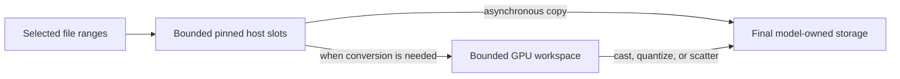

# Proposal: bounded streaming weight loading

Status: C99 O_DIRECT transport and initial b12x vLLM adapter, September 6,
2026. The adapter registers `--load-format b12x`, uses explicitly locked,
CPU-addressable CUDA pools for final weights, and routes metadata-only source
views through `vllm.model_executor.weight_transfer`. Selected payload ranges
are read with O_DIRECT; buffered fallback and mmap input are not used. Existing
model name routing, MTP prefix filtering, and quantization remain in place.
Arbitrary source arithmetic and unsupported layouts fail explicitly. Native
descriptor batches execute through eight persistent pthread readers by default
(`io_threads`, 1–16). C owns range ordering, splitting, dispatch, and completion;
Python retains destination and file owners through each batch. The aggregate
target/draft transform budget below remains work to do.

Allocation policy belongs to the loader. Layers mark weight factories with
`allocate_weights(factory, ...)`; `weight_transfer` supplies the selected
allocator. All other allocations use ordinary CUDA storage, including model
construction and preparation workspaces. Shared weight storage is read-only
during inference. The adapter rejects shared non-persistent buffers at load
completion instead of silently placing runtime writes in host-mapped storage.

For the validated GB10 decode configuration, opt in with the matching b12x
package installed:

```sh
VLLM_PLUGINS=b12x_loader vllm serve MODEL --load-format b12x
```

The loader always uses mapped, pinned storage with write-combined CPU caching
for weights. There is no serving `allocation` option; alternative mappings
remain confined to b12x's allocation-qualification tools.
The adapter uses the standard vLLM checkpoint-shard progress format and honors
the existing progress setting and rank-zero output. The initial
adapter requires GPU host page tables and the native Torch CUDA allocator;
vLLM sleep mode is unsupported. Aligned ranges read into final allocations;
large misaligned ranges read into the same allocations and realign in place.
Small edges use a fixed 8 MiB locked buffer per reader and an explicitly counted
copy. BF16-to-FP32 expands backwards in the destination allocation in
C99 without conversion scratch. Other contiguous casts use one reusable 8 MiB
input allocation. Existing b12x preparation policies control weight reuse and
packing; the adapter does not retain a duplicate packed representation.

Checkpoint copy hooks can queue native descriptors. Online quantization,
composed weight transforms, PLE scale validation and final preparation explicitly
complete pending transfers before consuming values. Metadata-only layerwise
probes retain Torch copy counting without submitting I/O. Scalar control metadata
is read in coalesced spans instead of one disk operation per scalar.

Logs distinguish physical I/O, direct destination bytes, alignment copies,
conversions, and final shared parameter bytes. Custom uninstrumented copy sites
and arbitrary quantization transients are not covered by those counters. They
are not an end-to-end memory-bound claim.

The InstantTensor copy/buffer overrides and oversized CPU fallback are removed;
Qwen MTP declares checkpoint prefixes to skip unrelated target shards.

Replace the whole-tensor iterator on the fast path with a loader that reads
selected checkpoint ranges into model-owned destinations. Implement a small
loader component in `b12x.loader` with explicit range and completion APIs.
b12x owns manifest parsing, scheduling, memory budgets, transport, and generic
transforms. vLLM supplies model name mappings, TP/EP slices, destination handles,
and numerical requirements. A tensor handed to an ordinary model loader must
own its storage. Reusable staging views stay inside the controlled executor.

## b12x component scope

The implementation belongs in the existing b12x package. The inspected
InstantTensor source has about 4,000 lines across its Python frontend, native
translation units, and top-level native headers, excluding dynamic bindings,
vendored dependencies, tests, and packaging. This is a manageable implementation
scale, although line count does not measure the effort of validating it.

Much of its surface supports multiple I/O backends, collective loading, a
safetensors-compatible tensor iterator, generic worker executors, and dynamic
library bindings. Our first target is Linux/aarch64 GB10, with CUDA, local
files, explicit file ranges, bounded host staging, asynchronous copies into
owned destinations, and correct completion/error handling. It does not need
feature parity with every InstantTensor backend to serve Qwen and GLM here.

Use a small C99 native helper with positional file I/O and CUDA calls, following
the cached host-compiler approach in `b12x.comm.roce`. The prototype creates
owned DLPack capsules through the CPython C API without the PyTorch C++ ABI. Batch
range submission and completion handling in native code. b12x plans generic
transforms from the model requirements provided by vLLM. Reuse safetensors header validation
where practical. A small threaded positional-read implementation can serve as
a correctness reference for the same range API. Any alternate transport keeps
identical ownership and memory-budget semantics; tensor size never selects a
different loading contract.

The public transport interface needs operations equivalent to `submit_reads`,
`copy_into`, `poll`, `wait`, and `close`. Requests retain destination owners,
file handles, and registered memory until their completion. Raw pointers alone
are not lifetime guarantees. Registered transforms obtain scoped workspace and
must return completion dependencies; arbitrary callbacks cannot retain staging.
Use one bounded scheduling state machine before introducing a generic executor
framework. Prototype transport throughput first, then migrate model adapters.

Keep `b12x.loader` independent of vLLM imports and lazy-load its native helper
and GPU transforms. Reuse b12x quantization and packing implementations where
their contracts match. The vLLM integration can register `--load-format b12x`
through its public loader registry and b12x's general-plugin entry points.
The substantial integration work remains the model load descriptions and
bounded quantization/finalization described below. Replacing the I/O package
alone will not make legacy deferred tensor consumers safe. The b12x-side module
layout and build contract are proposed in `b12x/docs/checkpoint-loading.md`
(path relative to the parent projects directory).

## Findings before the loader cleanup

The audited environment used InstantTensor 0.1.9. Its installed `_impl.py` is
byte-identical to upstream tag `v0.1.9`. vLLM was inspected at `17e341b9ed`.

| Observation | Consequence |
| --- | --- |
| `safe_open(copy=False)` returns views into a recycled device ring. | A consumer that defers loading a weight, or keeps a view, can silently load different bytes. |
| `tensors()` calls `torch.cuda.current_stream().synchronize()` before every tensor. | Submission is serialized at tensor granularity, including scalar scales. This protects only work on that stream. |
| The requested device buffer is enlarged to fit the largest tensor and native I/O window. Host staging is allocated separately. | `INSTANTTENSOR_BUFFER_SIZE` is not a total memory ceiling. |
| vLLM changes private InstantTensor metadata before opening I/O and routes oversized tensors through CPU safetensors. | Correctness, accounting, and behavior depend on tensor size and package internals. |
| The `_vllm_instanttensor_borrowed` attribute has no consumer in this vLLM tree. Tensor views also need not preserve Python attributes. | The marker does not enforce ownership. |
| Online layerwise loading can queue tensor arguments until a layer is complete. | Fixing the two GLM weight/scale queues does not establish a general safe contract. |

The GLM failure was concrete: deferred selector weight/scale pairing retained
recycled views. All 11 target selector head matrices were wrong; three contained
NaNs. Commit `17e341b9ed` clones retained inputs and fixes that failure. Keep that
repair until those consumers use the new contract.

Header-only inspection of the local checkpoints produced these counts. Payload
sizes include all tensors selected by the checkpoint index, before model/rank
filtering.

| Checkpoint | Indexed payload | Tensors | Tensors at most 4 KiB | Their combined payload | Largest tensor |
| --- | ---: | ---: | ---: | ---: | ---: |
| Qwen 3.8 Flash Next mixed | 98.53 GiB | 301,730 | 149,420 | 1.23 MiB | 1,212.5 MiB |
| GLM 5.3 Flash 4p67 | 174.73 GiB | 149,893 | 73,949 | 0.66 MiB | 1,210 MiB |

Most small tensors are scalar `input_scale` and `weight_scale_2` entries. They
should be read and installed in batches, without a CUDA synchronization and
temporary tensor allocation for every scalar.

Qwen's MTP name mapper at the audited revision accepts 4,639 tensors totaling 3.86 GiB, including
the embedding and LM head. That revision did not declare MTP checkpoint prefixes,
so its InstantTensor pass read the full 98.53 GiB before rejecting
irrelevant names. Selection alone can omit 96.1% of that pass's logical payload.
The last startup logged 62.95 seconds for target loading and 34.64 seconds for
the second weight load. These are startup observations, not controlled speedup
measurements; selection does not imply a proportional wall-time reduction.

Before cleanup, the GLM launcher routed 14 tensors above 64 MiB through CPU
safetensors. Qwen had 130 tensors above that threshold and used a 1.25 GiB
device ring. Those InstantTensor workarounds are no longer used.

## Ownership and API

Introduce three concepts, separate from the existing tensor iterator:

- `WeightRef`: immutable checkpoint identity, tensor name, dtype, shape, file
  offset, and length. Keeping a reference keeps metadata, not a GPU buffer.
- `WeightLoadPlan`: source slices, destination slices, dependencies, transforms,
  allocation sizes, and completion requirements. b12x builds the execution plan
  from the metadata supplied by model and quantization adapters; those adapters
  do not receive borrowed tensors to inspect or duplicate scheduling policy.
- `WeightLoadSession`: executes plans for the target and draft with one budget
  per physical memory domain. It owns staging and outstanding work until drained.

Illustrative interface, not a drop-in implementation:

```python
from b12x import loader

manifest = loader.CheckpointManifest.open(model_path)
description = model.describe_weight_loading(manifest, parallel_config)
plan = loader.plan(description, staging_memory_bytes=256 << 20)
with loader.WeightLoadSession(plan) as session:
    session.execute(plan)
    session.finish()
```

Plan operations cover direct copies, cast/scatter operations, and explicitly
registered transform implementations with declared workspace and dependencies.
The executor resolves destination handles after their allocation, preserving
parameter attributes, tied storage, packed layouts, and reload addresses.
For online quantization, reuse meta placeholders but materialize final packed
weights and scales directly. Bypass the legacy layerwise step that materializes
the complete BF16 weight before quantization; otherwise that full intermediate
would defeat the staging budget. Finalization becomes an explicit plan
dependency and may not allocate undeclared full-size copies.

For an unconverted model, the existing `Iterable[tuple[str, Tensor]]` interface
continues to yield **owned** tensors. It can be slower and must identify itself
as a compatibility path in the load summary. Never expose a ring view to it,
even when the caller requests `copy=False`.

An arbitrary legacy consumer can retain every input or allocate untracked
intermediates. No iterator can promise a small end-to-end memory bound under
that contract. Count materialized sources while their storage remains live;
if retained ownership prevents progress, raise an actionable budget error
instead of waiting forever. A supported planned load has a bounded schedule;
legacy consumers require conversion before receiving that guarantee.

Do not attempt to enforce this using tensor attributes, reference-count
heuristics, or a Tensor subclass that intercepts arbitrary PyTorch operations.
Storage aliases and asynchronous work make those approaches fragile.

## Native transport and synchronization

### Allocate for direct reads on GB10

The first question is whether final weights can use GPU-mapped host allocations.
An ordinary CUDA allocation is not a valid CPU file-read destination merely
because GB10 shares physical DRAM. However, a mapped host allocation exposes a
CPU address for file reads and a GPU address for kernel access. The planned
loader controls allocation, so it must investigate this option before assuming
every weight needs an intermediate buffer and a host-to-device copy.

For bytes already in their runtime layout, the candidate path is:


For conversion, read bounded mapped input tiles and have the GPU quantizer or
packer consume those tiles directly, writing the final destination. This can
avoid a separate GPU input-staging allocation even when the final destination
uses ordinary CUDA memory. BF16 checkpoint bytes cannot simply be read into an
MXFP8 or NVFP4 destination: conversion and its scale dependencies still apply.

Qualify both the allocation/framework interface and the actual consuming
kernels. In particular, wrapping mapped storage must not cause an implicit
framework copy; TMA, dense/MoE kernels, embeddings, scales, and captured graphs
must preserve correctness and inference throughput. Check large allocations
and 64-bit addressing as well. Keep CPU/GPU aliases under one owner for the
entire model and graph lifetime. Publish file-read completion before GPU use;
do not permit CPU writes while inference reads the same ranges.

Existing `create_weights` and `process_weights_after_loading` methods allocate
and sometimes replace tensors. Converted adapters need allocation hooks for
the chosen final representation and an explicit finalization step. Otherwise
an ordinary `.to("cuda")`, whole-tensor quantization, or `pack_weight` call could
silently restore the copies this design intends to eliminate. Initial support
is startup loading; active in-place reload and rollback need a separate design.

Buffered reads into the final address still involve the OS page cache. Test
aligned direct I/O independently; reading into mapped host memory is not native
GDS. NVIDIA limits Spark GDS to compatibility mode. The allocation qualification
and candidate paths are specified in `b12x/docs/checkpoint-loading.md` in the
companion checkout, with links to NVIDIA's allocation documentation.

### Bounded transfer route

The b12x transport accepts batches of explicit file ranges and
caller-owned destinations, a supplied allocator/budget, and completion handles.
InstantTensor's present `get_dl_tensor()` interface and whole-tensor ring layout
cannot implement the required bound for oversized tensors and are not retained
in the new API.

For a destination or transform that requires ordinary CUDA input storage, use:



Use fixed-capacity slots. Reads complete before their host memory is consumed.
Record transfer completion before reusing a host slot; record final transform
completion before reusing a GPU slot. If work uses multiple streams, join every
consumer into its retirement event. Python iterator advancement is never a
retirement signal. A borrowed view may exist inside a registered executor
operation, but must not escape it.

Wait for the oldest relevant event only when capacity is exhausted. Remove
per-tensor current-stream synchronization from the planned path. Complete all
outstanding work before publishing loaded parameters, unregistering memory,
or closing a session. On cancellation or I/O failure, stop submissions and
drain/cancel reads and CUDA users before releasing their storage; never publish
partially initialized weights. Mid-load retry must not silently replay
non-idempotent transforms.

Begin allocation/transport qualification with batched positional reads into
declared destinations. Select a small native reader pool or io_uring from
measurements, retaining the same range/completion ABI. Compare direct I/O under
cold and warm cache conditions. Native GDS is a later option for platforms that
support it; it is not the GB10 transport. Choose the mapped or CUDA destination
per supported consumer during planning, independently of tensor size.

## Budget and large tensors

Add one user-facing setting, `staging_memory_bytes`, for the aggregate live
temporary byte buffers used by a session: pinned host slots, GPU staging,
retained materializations, transform inputs/outputs that are not final storage,
and alignment overhead. Cached buffers count too. Release them at session end;
there is no unbounded process-global pinned-memory cache.

On GB10, host and GPU staging consume the same physical memory pool, so charge
both against one aggregate budget. On a discrete GPU, retain the aggregate cap
and separately check available host and device capacity. Multiple ranks on the
same memory domain receive coordinated reservations; each must not independently
claim the entire free-memory estimate.

Final model allocations, compact manifest/plan metadata, CUDA/context overhead,
and external processes are separate from this staging cap and must be included
in startup capacity checks. Report them separately. The loader cannot provide
a hard bound on OS page-cache residency or other processes. Buffered reads may
use reclaimable page cache; also measure process RSS, pinned memory, CUDA memory,
and system available memory. PyTorch allocator peaks alone miss native buffers.

Start validation at **256 MiB aggregate staging per GB10 session**, with 8 MiB
read chunks. This is a candidate default, not a measured optimum. Partition
capacity among transport and the current transform, reserve enough to finish
one operation, and apply backpressure to prefetch. Avoid deadlock where prefetch
occupies the workspace needed to retire those same reads. Shrink chunks or
queue depth within the cap; never enlarge the budget to fit a tensor.

A 1.2 GiB embedding can be read into its final allocation in small row ranges;
it does not require a 1.2 GiB ring or a full CPU fallback tensor. Respect file-I/O
alignment with bounded edge buffers, and use 64-bit offsets and byte counts.
Validate packed dtype alignment, quantization block boundaries, and destination
padding. Coalesce nearby ranges with an explicit read-amplification bound.

Transforms require their own bounded implementations:

- **MXFP8 LM head:** read BF16 rows and quantize block-aligned tiles directly into
  the final FP8 and scale arrays. Preserve scale layout and rounding. Do not
  materialize an additional full BF16 head merely to quantize it.
- **NVFP4 draft head:** preserve the existing global scale calculation. First
  compute amax over the same TP-local logical weight/padding domain as today,
  then reread chunks and quantize using that scale. Reuse a simultaneous target
  head read for the reduction when scheduling permits. Do not substitute a
  different scale per chunk or requantize an already quantized target head.
- **GLM selector/deferred attention projections:** dependency groups explicitly
  pair weights and scales, regardless of checkpoint order. Keep small scales
  owned, stream corresponding weight tiles, and write the converted destination.
- **Serialized MoE weights:** map expert and TP slices into existing packed
  destinations. Batch scalar scales and use bounded workspace for required
  repacking. Preserve existing quantization semantics and global reductions.

If a transform cannot operate within the budget, its plan must declare the
minimum required workspace before payload loading. Convert the transform or
report that requirement. A larger whole-tensor allocation hidden behind a CPU
fallback is not an acceptable implementation of the budget.

## Selection, batching, and target/draft reuse

Parse and validate the safetensors index before payload reads. A composed index
is authoritative for duplicate names; unindexed ambiguous duplicates are an
error. Validate header bounds, tensor sizes, required names, and file identity.
Retain open file identities or validate them at use so a cached manifest cannot
silently refer to replaced checkpoint contents.

Build selection from existing name mappers plus explicit model/quantization
adapters. Cover persistent buffers, ignored names, aliases, shared experts,
packed QKV, TP/EP/PP ownership, and scales. Do not infer all semantics solely
from `named_parameters()` or tensor shapes. Preserve strict coverage checks for
quantized models too: every required source and destination is accounted for,
and only declared alias/reduction writes may overlap.

Schedule bounded dependency groups while coalescing nearby disk ranges. Small
scales travel in compact batches and are scattered into their destinations;
CPU-needed scalars stay on the CPU until a declared consumer needs them. Avoid
hundreds of thousands of tiny `.item()` transfers, allocations, or copy launches.
Use compact range records and shared name tables rather than retaining multiple
copies of large Python header dictionaries.

The first Qwen improvement can reuse `checkpoint_weight_name_prefixes`, already
used by GLM MTP. The complete plan selects exact accepted names before transport,
including necessary shared embeddings and heads. Keep one manifest/session
across target and draft. Read a shared source once when both destinations can
consume it within budget; otherwise reread only that selected source. Do not
hold the whole checkpoint awaiting draft construction. Storage sharing is valid
only where model semantics allow it; different target/draft head precision
requires distinct final representations.

For tachyon/luxon, initially use independent rank-local reads from local storage.
TP slicing selects required bytes, not just required names. Replicated tensors
remain replicated. Existing InstantTensor distributed loading uses all-gather
and assumes a common schedule; independent rank plans must not be fed to that
collective schedule. A later collective transport needs explicit common ordering
and destination routing, justified by topology measurements.

## Delivery and compatibility

1. Qualify direct file reads into mapped final allocations and direct GPU
   consumption of mapped conversion input on GB10. Test the real consuming
   kernels and framework ownership before building the full scheduler. Exact
   Qwen draft shard filtering and the GLM clone repair are already present.
2. Build and test `b12x.loader`, its native range/destination helper, bounded
   allocator, event retirement, cancellation, and session. Add copy/slice/batched-scale
   adapters and tile transforms for Qwen heads, MoE, and PLE first; extend to
   GLM TP2 after the GB10 TP1 path is qualified.
   Reuse existing numerical kernels where their interfaces permit bounded output.
3. Integrate target/draft sessions and layerwise finalization; validate all
   required paths under memory pressure. Make the planned path the default for
   these models only after correctness and startup benchmarks pass. The
   private-metadata surgery, oversized CPU-tensor branch, and borrowed marker
   have already been removed. Other models retain the safe
   owned compatibility interface until converted.

Register `--load-format b12x` through a b12x vLLM plugin. Keep InstantTensor selectable
for comparison and rollback during validation; do not silently redirect its
format name to a different implementation. The new format has no
`instanttensor_copy` option: ownership is an invariant. Switch launchers after
the release gates pass, replacing ring sizes with the aggregate budget. Native
chunk/depth overrides must fit that budget or fail validation. Report requested
and actual capacities plus the chosen transport in a concise load summary.

Pin a tested b12x revision and validate native helper builds on aarch64 and x86_64.
An upgrade alone is insufficient: upstream `9fb7aa73` improves buffer validation
but still has borrowed views and per-tensor synchronization. It also renamed
`_determine_buffer_size` to `_finalize_buffer_size`, which was incompatible with the removed private-API
adapter. Use a versioned public capability check and test against the exact
package deployed for any future integration.

## Acceptance criteria

Extend existing loader, reload, GLM model, and quantization suites. Use native
transport tests for storage lifetimes and injected I/O failures; put startup
benchmarks outside `tests/`.

- Repeated ring/slot reuse, weight-before-scale and scale-before-weight, retained
  aliases, delayed consumers, cancellation, and work on two CUDA streams never
  alter owned outputs or reuse live memory. Unsupported legacy retention fails
  explicitly rather than corrupting data or hanging.
- A tensor much larger than the cap loads correctly without raising peak staging
  above it. Include boundary tails, unaligned file ranges, offsets above 4 GiB,
  all supported dtypes, TP slices, aliases, and adversarial checkpoint ordering.
- Compare serialized destination bytes exactly against safe safetensors loading.
  Compare transformed weights/scales against the same existing quantizers and
  dequantizers; require exact results for equivalent operations and investigate
  any numerical difference. Audit all GLM target and MTP selector matrices for
  finiteness and equality. Then run fresh/cached model prompts and model evals;
  serving-output nondeterminism must not replace weight-level validation.
- Record physical bytes read, selected payload, read amplification, transport
  bytes, host/device/transform high-water marks, synchronization counts, and
  target/draft/finalization timings. An end summary must expose compatibility
  materializations and any planned rereads.
- Compare the historical InstantTensor measurements, safe `copy=True`, CPU safetensors,
  and the new pipeline on Qwen TP1 and GLM TP2, with MTP off/on. Measure cold and
  warm cache separately without flushing caches during active serving. Target
  equal-or-better startup time than the present fast configuration, zero giant
  CPU fallback tensors, bounded 256 MiB staging, and elimination of full-checkpoint
  MTP rereads. These are release gates, not performance claims.
- Once the session drains, it leaves no staging allocations or streams needed
  by inference. Confirm steady-state decode throughput remains unchanged within
  benchmark variability.

## Evidence locations

- Local integration: `vllm/model_executor/model_loader/weight_utils.py`,
  `default_loader.py`, and `reload/layerwise.py`.
- Model contracts: `vllm/models/qwen3_8_flash_next/mtp.py`,
  `vllm/models/glm5next/nvidia/model.py`, and `mtp.py`.
- Local header audit: `.profiles/instanttensor-redesign-20260905/manifest-summary.json`
  and the adjacent Qwen/GLM manifests. No checkpoint payloads or GPU allocations
  were needed for this audit.
- Corruption investigation and startup log:
  `.profiles/glm53-correctness-bisect-20260905/findings.md` and `qwen-restored.log`.
- [Installed-version Python implementation](https://github.com/scitix/InstantTensor/blob/v0.1.9/instanttensor/_impl.py)
  and [native allocation implementation](https://github.com/scitix/InstantTensor/blob/v0.1.9/csrc/loader_common.cpp).
- [Inspected upstream implementation](https://github.com/scitix/InstantTensor/blob/9fb7aa73e61a5093f38a475b698d448d75cabf4b/instanttensor/_impl.py)
  and [ownership contract](https://github.com/scitix/InstantTensor/blob/9fb7aa73e61a5093f38a475b698d448d75cabf4b/README.md#zero-copy-mode).
